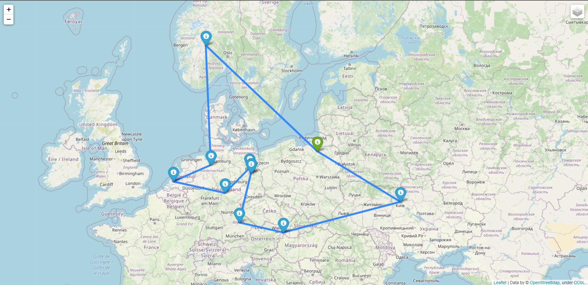

# Geofilm
#### Description
Python application that displays 10 nearest filming locations on the map and visualizes shortest path you need to travel through every location.
#### Installation
Clone repository and install requirements.txt
```bash
pip -r requirements.txt
```
#### Usage
```bash
python main.py <year> <latitude> <longitude> <path_to_dataset>
```
This will generate map.html file where 10 nearest filming locations of given year from given dataset will be displayed. Moreover, it will contain shortest path between all of those locations.
#### Example Output

